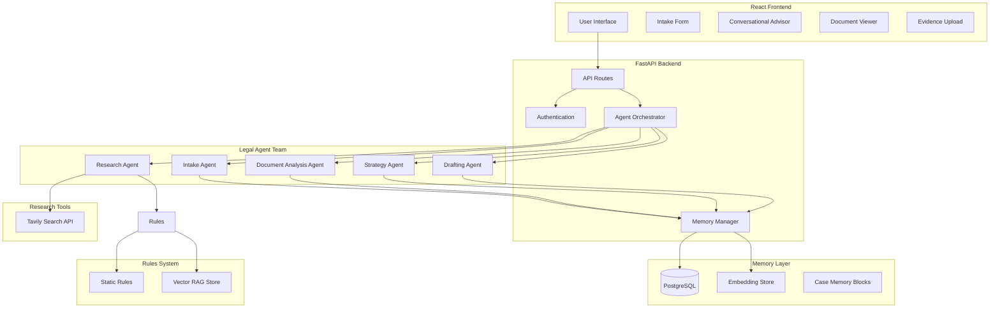
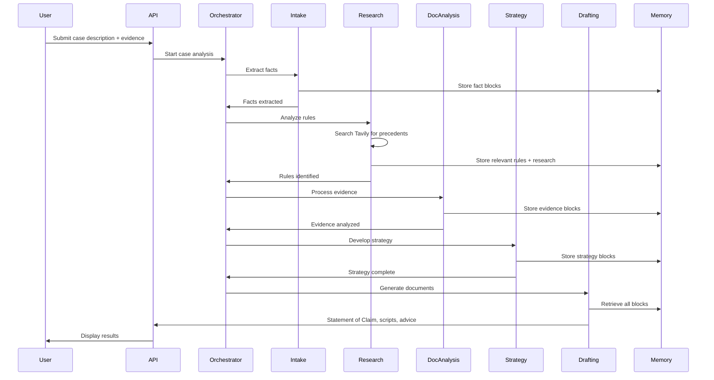

# Minnesota Conciliation Court Case Agent - Implementation Plan

## Architecture Overview

The application uses a Python FastAPI backend with React frontend, OpenAI agents, PostgreSQL with embeddings for memory, and a hybrid rules system combining static Minnesota court rules with RAG for case law.

## Core Components

### 1. Backend Structure (`backend/`)

**FastAPI Application** (`backend/main.py`)

- FastAPI app with CORS, authentication middleware
- WebSocket support for real-time agent updates
- Route handlers for case management, agent interactions

**Agent System** (`backend/agents/`)

- `orchestrator.py`: Coordinates agent workflow, manages agent handoffs
- `intake_agent.py`: Extracts facts, categorizes dispute type
- `research_agent.py`: Analyzes Minnesota Conciliation Court rules, finds relevant precedents using Tavily search and RAG
- `document_agent.py`: Processes uploaded evidence (PDFs, images, text)
- `strategy_agent.py`: Develops case strategy, identifies strengths/weaknesses
- `drafting_agent.py`: Generates Statement of Claim, hearing scripts, advice

**Tools** (`backend/tools/`)

- `tavily_search.py`: Tavily API integration for web research, case law lookup, recent precedents

**Memory Layer** (`backend/memory/`)

- `memory_manager.py`: Manages case memory blocks, embeddings, retrieval
- `embeddings.py`: OpenAI embeddings for semantic search
- `case_blocks.py`: Structured memory block schema (facts, evidence, strategy, rules)

**Database** (`backend/database/`)

- `models.py`: SQLAlchemy models (User, Case, MemoryBlock, Document, Session)
- `schemas.py`: Pydantic schemas for API validation
- `migrations/`: Alembic migrations

**Rules System** (`backend/rules/`)

- `static_rules.py`: Embedded Minnesota Conciliation Court rules (statutes, procedures)
- `rag_store.py`: Vector store for case law, precedents, interpretations
- `rule_retriever.py`: Retrieves relevant rules for agent queries

**Document Generation** (`backend/documents/`)

- `statement_of_claim.py`: Generates court-ready Statement of Claim PDF
- `hearing_script.py`: Creates hearing preparation scripts
- `advice_generator.py`: Formats agent advice into user-friendly documents

### 2. Frontend Structure (`frontend/`)

**React Application** (`frontend/src/`)

- `App.tsx`: Main app router, authentication wrapper
- `components/`: Reusable UI components
- `pages/`: Route pages (Dashboard, CaseDetail, NewCase)
- `hooks/`: Custom React hooks (useCase, useAgents, useMemory)
- `services/`: API client, WebSocket client

**Key Pages**

- `IntakePage.tsx`: Initial case description and evidence upload
- `CaseDashboard.tsx`: View case status, agent progress, generated documents
- `AdvisorTab.tsx`: Conversational interface for iterative refinement
- `DocumentViewer.tsx`: Display generated Statement of Claim, scripts, advice

**Agent Status UI** (`frontend/src/components/AgentStatus.tsx`)

- Real-time visualization of agent workflow
- Progress indicators for each agent stage
- Agent reasoning/analysis display

### 3. Database Schema

**Core Tables**

- `users`: Authentication, user profiles
- `cases`: Case metadata (title, status, created_at, updated_at)
- `case_sessions`: Multi-session support (session_id, case_id, timestamp)
- `memory_blocks`: Structured case memory (type: fact/evidence/strategy/rule, content, embeddings)
- `documents`: Uploaded evidence (file_path, file_type, extracted_text, embeddings)
- `agent_runs`: Agent execution history (agent_type, input, output, timestamp)
- `generated_documents`: Statement of Claim, scripts, advice (document_type, content, file_path)

### 4. Agent Workflow

### 5. Memory Block Structure

Each memory block contains:

- `block_id`: Unique identifier
- `case_id`: Associated case
- `block_type`: `fact`, `evidence`, `strategy`, `rule`, `question`
- `content`: Structured JSON with relevant data
- `embedding`: Vector embedding for semantic search
- `metadata`: Timestamps, agent source, confidence scores
- `relationships`: Links to related blocks

### 6. Implementation Steps

1. **Project Setup**

   - Initialize FastAPI backend with dependencies (openai, sqlalchemy, alembic, fastapi-users)
   - Initialize React frontend with TypeScript, Vite, Tailwind CSS
   - Set up PostgreSQL database
   - Configure environment variables (.env files)

2. **Database & Models**

   - Create Alembic migrations for schema
   - Implement SQLAlchemy models
   - Set up embedding storage (pgvector extension or separate embedding column)

3. **Authentication**

   - Implement FastAPI-Users for authentication
   - Create login/signup pages
   - Add protected routes middleware

4. **Memory Layer**

   - Implement memory manager with embedding generation
   - Create memory block CRUD operations
   - Build semantic search functionality
   - Implement multi-session case retrieval

5. **Rules System**

   - Embed Minnesota Conciliation Court rules (MN Statutes Chapter 491A, court procedures)
   - Set up vector store for case law/precedents
   - Create rule retrieval system

6. **Agent Implementation**

   - Build agent base class with OpenAI integration
   - Implement each agent with specific prompts and tools
   - Create orchestrator for agent coordination
   - Add agent reasoning logging

8. **Document Processing**

   - Implement file upload handling (PDF, images, text)
   - Add OCR for images/PDFs (Tesseract or cloud service)
   - Extract text and generate embeddings

9. **Document Generation**

   - Create Statement of Claim template (Minnesota court format)
   - Implement PDF generation (ReportLab or WeasyPrint)
   - Build hearing script generator
   - Format advice documents

9. **Frontend - Core Pages**

   - Build intake form with file upload
   - Create case dashboard with agent status
   - Implement conversational advisor interface
   - Add document viewer/download

11. **Real-time Updates**

    - Set up WebSocket connection for agent progress
    - Implement agent status broadcasting
    - Add live reasoning display

11. **Multi-session Support**

    - Implement session management
    - Add case state persistence
    - Build context restoration on return

13. **Testing & Polish**

    - Add error handling and validation
    - Implement loading states and user feedback
    - Add unit tests for agents and memory layer
    - Polish UI/UX

## Key Files to Create

**Backend:**

- `backend/main.py` - FastAPI application entry point
- `backend/agents/orchestrator.py` - Agent coordination
- `backend/agents/intake_agent.py` - Fact extraction agent
- `backend/agents/research_agent.py` - Rules research agent with Tavily integration
- `backend/agents/document_agent.py` - Evidence analysis agent
- `backend/agents/strategy_agent.py` - Case strategy agent
- `backend/agents/drafting_agent.py` - Document generation agent
- `backend/tools/tavily_search.py` - Tavily search API wrapper
- `backend/memory/memory_manager.py` - Memory layer core
- `backend/database/models.py` - Database models
- `backend/rules/static_rules.py` - Embedded court rules
- `backend/documents/statement_of_claim.py` - Claim document generator

**Frontend:**

- `frontend/src/App.tsx` - Main application
- `frontend/src/pages/IntakePage.tsx` - Case intake
- `frontend/src/pages/CaseDashboard.tsx` - Case overview
- `frontend/src/components/AdvisorTab.tsx` - Conversational interface
- `frontend/src/components/AgentStatus.tsx` - Agent progress display
- `frontend/src/services/api.ts` - API client

## Dependencies

**Backend:**

- fastapi, uvicorn
- sqlalchemy, alembic, psycopg2
- openai
- tavily-python (Tavily Search API)
- python-multipart (file uploads)
- pypdf2/pdfplumber (PDF processing)
- pillow (image processing)
- reportlab/weasyprint (PDF generation)
- fastapi-users (authentication)
- websockets

**Frontend:**

- react, react-router-dom
- typescript
- axios (API client)
- tailwindcss
- socket.io-client (WebSocket)
- react-dropzone (file uploads)

## Environment Variables

- `DATABASE_URL` - PostgreSQL connection string
- `OPENAI_API_KEY` - OpenAI API key
- `TAVILY_API_KEY` - Tavily Search API key
- `SECRET_KEY` - JWT secret for authentication
- `FRONTEND_URL` - Frontend URL for CORS

## Notes

- Agents use OpenAI GPT-4 with function calling for structured outputs
- Memory blocks use embeddings for semantic retrieval across sessions
- Minnesota rules embedded from official sources (MN Statutes, court websites)
- Statement of Claim follows Minnesota Conciliation Court format requirements
- Multi-session support maintains full context through memory block relationships